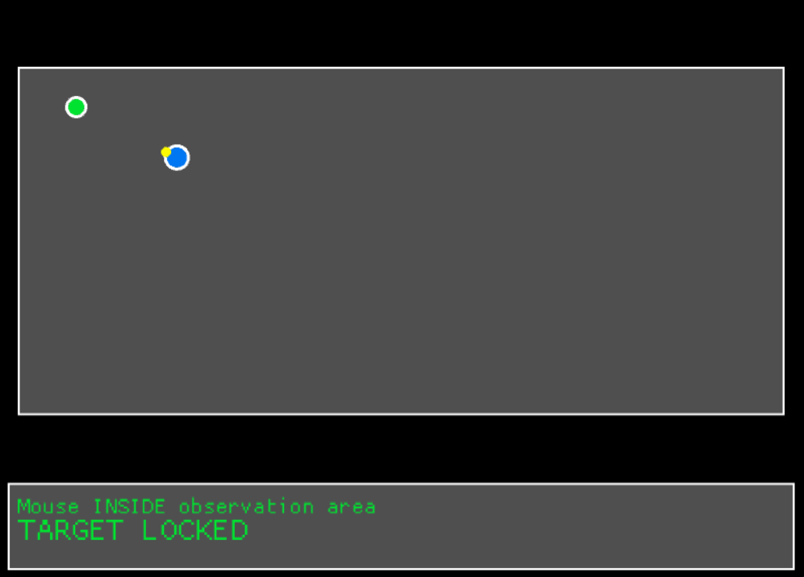

# Path Finding Project


[](https://opensource.org/licenses/MIT)

once you lauch you will see the agent and can put down a tagret which the agent will navigate to.


---

## Tech Stack

- Language: Rust
- Main libs/frameworks: Macroquad

---

## Features


-  the agent which can move to a target
-  setting a target (left click) & removing a target (right click)


- the newest version hasn't been pushed since it's really buggy, try fixing those bugs
- the agent currently just.. well goes in a straight line, i may add some turning and angles to make it feel more natural
- when moving the cursor outside the observation window everything just stops... which is, somewhat cool? but it feels weird, i'll have to decide if i'm going to change that

---

### Installation

```bash
# clone the repo
git clone https://github.com/CodeWithCompound/path-finding-project.git
cd path-finding-project


